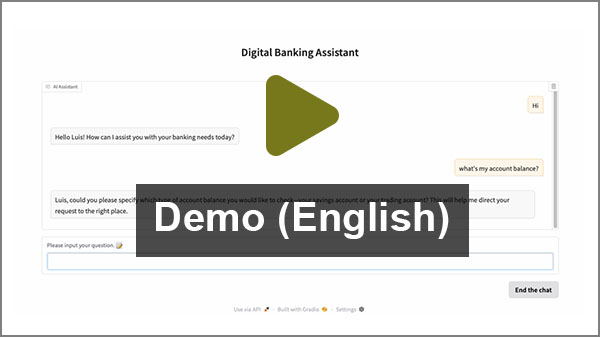
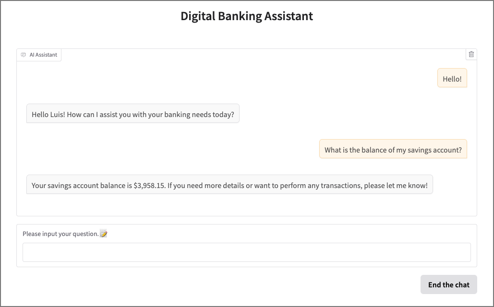

# 💬 Digital Banking Assistant

## 🧠 Overview

Digital Banking Assistant is an AI-powered chatbot designed to simulate real-world banking interactions across digital channels.

Built on the LangGraph framework and powered by multi-agent workflows, it offers a conversational interface via Gradio to help users manage savings, trading, and digital banking tasks.  
<table>
  <tr>
    <td>
      <a href="https://www.bilibili.com/video/BV1WwJ2zTEWV/">
        
      </a>
    </td>
    <td>
      <a href="https://www.bilibili.com/video/BV1AwJ2zTE9G/">
        
      </a>
    </td>
  </tr>
</table>
---

## ⚙️ Setup Instructions

To run the project locally:

#### 1. Clone the Repository

```bash
git clone https://github.com/lituokobe/Digital-Banking-Chatbot.git
cd Digital_Banking_Assistant
```
#### 2. **Create a Virtual Environment (Recommended)**  
   - With pip:
     ```bash
     python3.11 -m venv venv
     source venv/bin/activate  # Mac/Linux
     venv\Scripts\activate   # Windows
     pip install -r requirements.txt
     ```
   - With conda:
     ```bash
     conda env create -f environment.yml
     conda activate banking-assistant
     ```

#### 3. **Configure Environment Variables**  
   - Rename `.env.example` → `.env`
   - Add required keys:
     ```
     OPENAI_API_KEY=your_openai_api_key
     TAVILY_API_KEY=your_tavily_api_key
     ```
   - By default, the project uses `gpt-4.1`. To switch providers, update `./graph/llm.py` and set the relevant API key.

   > **Note:** Tavily is the default search engine. Get a free trial key at [https://tavily.com](https://tavily.com).

#### 4. **Launch the Assistant**
   ```bash
   python -m graph.chatbot
   ```
If successful, you will see:

```
* Running on local URL:  http://127.0.0.1:7860
* To create a public link, set `share=True` in `launch()`.
```
Open the URL in your browser to start chatting. 



---

## 💡 Features
You play the role of a bank client with **savings** and **trading** accounts. The assistant supports:

#### 1. Savings Account
   - Check balances  
   - View transaction history  
   - Review pending transfers  
   - Make transfers  

#### 2. Trading Account
   - Check cash balance  
   - View portfolio holdings & performance  
   - Get stock quotes/trends  
   - Place buy/sell orders  
   - Review pending orders  

#### 3. Digital Banking Usage
   - Ask about features of online/mobile banking  
   - Locate documents  
   - Customize digital interfaces  

#### 4. Relationship Management
   - Book/check appointments with your relationship manager  
   - Review upcoming appointments  

---

## 👥 Client Personas
By default, you interact as **Luis Zhang (ID: AB123)** — a young professional with a tech-heavy investment portfolio.

Other available personas:
- **Jun-hao Mariano (ID: PB367)** – University student with a part-time job. Invests in well-known brands. 
- **Satsuki Ukeja (ID: AB892)** – Retiree living on pension. Invests only in index funds. 
- **John Petrov (ID: PB519)** – Mid-aged blue-collar worker. No interest in investing.

To switch personas, adjust the config in `graph/chatbot.py`:  


---

## ⚠️ Limitations
This is a personal practice project with simulated banking logic:
- Only **savings** and **trading** accounts supported.  
- Transfers/orders are **simulated**, and remain pending. 
- Transfers require a recipient account number and bank name (use any for testing).  
- All transactions are in USD; no currency exchange is available.  
- Stock trading limited to **US equities**.  
- Only **day limit orders** allowed.
- Transfers/orders cannot be canceled after submission.  
- RAG-powered FAQ is based on a limited set of documents  

---

## 🧬 Architecture
The system uses **multi-agent workflows** coordinated by a **primary assistant**.

- **Primary Assistant** – orchestrates workflows, handles user info, manages appointments  
- **Trading Assistant** – queries DB, fetches stock info online  
- **Account Assistant** – handles savings account queries  
- **Digital Banking Assistant** – RAG-based answers for platform usage  

#### Workflow diagram:


---

## 📂 Project Structure

#### `./graph`
- `assistant.py` – prompts & runnables for all agents  
- `base_data_model.py` – defines shared data models for agents  
- `build_child_graph.py` – builds workflows for specialized assistants  
- `chatbot.py` – main entry point (workflow + GUI)  
- `entry_node.py` – logic for child workflow entry  
- `llm.py` – LLM configuration (default: `gpt-4.1`)  
- `state.py` – manages chat state, user info, workflow context  

#### `./database`
- `banking_data.db` – auto-generated SQLite DB  
- `banking_data.xlsx` – raw client dataset (editable for new personas)  
- `digital_banking_FAQ.md` – RAG knowledge base  

#### `./tools`
- `account_assistant_tools.py` – savings account tools  
- `DB_usage_assistant_tools.py` – digital banking FAQ tools  
- `trading_assistant_tools.py` – trading tools  
- `primary_assistant_tools.py` – primary assistant tools  
- `init_db.py` – refreshes DB on startup  
- `tools_handler.py` – error handling and utility functions.  

---

## 📬 Feedback & Contributions
This project demonstrates how **LangGraph**, **multi-agent workflows**, and **Gradio** can power a digital banking assistant with simulated accounts, trading, and customer service experiences.

Feel free to fork, star, or submit issues and pull requests — your ideas are welcome!